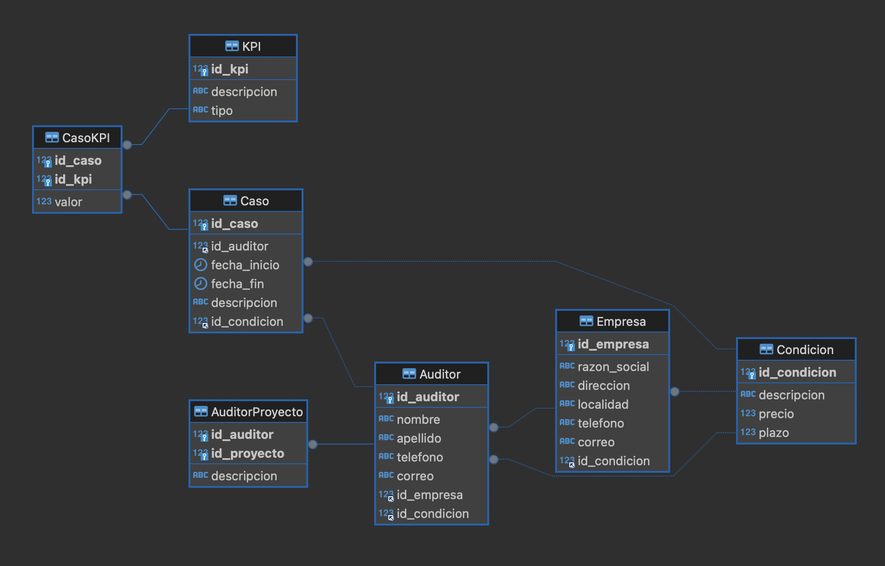

# Proyecto_AuditoriasCX
# Proyecto de Base de Datos para el Equipo de Auditores de CX

## Descripción de la temática de la base de datos

El objetivo de esta base de datos es gestionar y evaluar la información del equipo de auditores que realizan auditorías de casos de customer experience en diversas empresas. La base de datos almacenará detalles sobre las empresas, los auditores, los casos de auditoría, los indicadores clave de desempeño (KPIs), las condiciones de pago y trabajo, y la asignación de auditores a proyectos específicos.

## Diagramas de entidad relación de la base de datos

### Diagrama de Entidad-Relación

## Listado de tablas

### Empresa

Almacena información sobre las empresas que proporcionan los servicios de auditoría.
- **Atributos**:
  - `id_empresa`: Identificador único de la empresa.
  - `razon_social`: Nombre legal de la empresa.
  - `direccion`: Dirección física de la empresa.
  - `localidad`: Ciudad o localidad donde se encuentra la empresa.
  - `telefono`: Número de teléfono de la empresa.
  - `correo`: Dirección de correo electrónico de la empresa.
  - `id_condicion`: Referencia a la tabla `Condicion` para las condiciones de pago.

| PK/FK | Atributo     | TIPO      | Tamaño | NULIDAD   | AUTOINC. | DEFAULT | DESCRIPCIÓN                              |
|-------|--------------|-----------|--------|-----------|----------|---------|------------------------------------------|
| PK    | id_empresa   | INT       |        | NOT NULL  | SI       |         | Identificador único de la empresa        |
|       | razon_social | VARCHAR   | 255    | NOT NULL  | NO       |         | Nombre legal de la empresa               |
|       | direccion    | VARCHAR   | 255    | NOT NULL  | NO       |         | Dirección física de la empresa           |
|       | localidad    | VARCHAR   | 255    | NOT NULL  | NO       |         | Ciudad o localidad                       |
|       | telefono     | VARCHAR   | 20     | NOT NULL  | NO       |         | Número de teléfono                       |
|       | correo       | VARCHAR   | 255    | NOT NULL  | NO       |         | Correo electrónico                       |
| FK    | id_condicion | INT       |        | NOT NULL  | NO       |         | Referencia a la tabla `Condicion`        |

### Auditor

Contiene información sobre los auditores que realizan las auditorías de casos de customer experience.
- **Atributos**:
  - `id_auditor`: Identificador único del auditor.
  - `nombre`: Nombre del auditor.
  - `apellido`: Apellido del auditor.
  - `telefono`: Número de teléfono del auditor.
  - `correo`: Dirección de correo electrónico del auditor.
  - `id_empresa`: Referencia a la tabla `Empresa` indicando a qué empresa pertenece el auditor.
  - `id_condicion`: Referencia a la tabla `Condicion` para las condiciones de trabajo.

| PK/FK | Atributo     | TIPO      | Tamaño | NULIDAD   | AUTOINC. | DEFAULT | DESCRIPCIÓN                              |
|-------|--------------|-----------|--------|-----------|----------|---------|------------------------------------------|
| PK    | id_auditor   | INT       |        | NOT NULL  | SI       |         | Identificador único del auditor          |
|       | nombre       | VARCHAR   | 255    | NOT NULL  | NO       |         | Nombre del auditor                       |
|       | apellido     | VARCHAR   | 255    | NOT NULL  | NO       |         | Apellido del auditor                     |
|       | telefono     | VARCHAR   | 20     | NOT NULL  | NO       |         | Número de teléfono                       |
|       | correo       | VARCHAR   | 255    | NOT NULL  | NO       |         | Correo electrónico                       |
| FK    | id_empresa   | INT       |        | NOT NULL  | NO       |         | Referencia a la tabla `Empresa`          |
| FK    | id_condicion | INT       |        | NOT NULL  | NO       |         | Referencia a la tabla `Condicion`        |

### Caso

Registra los casos de auditoría realizados por los auditores.
- **Atributos**:
  - `id_caso`: Identificador único del caso.
  - `id_auditor`: Referencia a la tabla `Auditor` indicando qué auditor está asignado al caso.
  - `fecha_inicio`: Fecha de inicio del caso.
  - `fecha_fin`: Fecha de finalización del caso.
  - `descripcion`: Descripción del caso.
  - `id_condicion`: Referencia a la tabla `Condicion` para las condiciones aplicables al caso.

| PK/FK | Atributo      | TIPO      | Tamaño | NULIDAD   | AUTOINC. | DEFAULT | DESCRIPCIÓN                              |
|-------|---------------|-----------|--------|-----------|----------|---------|------------------------------------------|
| PK    | id_caso       | INT       |        | NOT NULL  | SI       |         | Identificador único del caso             |
| FK    | id_auditor    | INT       |        | NOT NULL  | NO       |         | Referencia a la tabla `Auditor`          |
|       | fecha_inicio  | DATE      |        | NOT NULL  | NO       |         | Fecha de inicio del caso                 |
|       | fecha_fin     | DATE      |        | NOT NULL  | NO       |         | Fecha de finalización del caso           |
|       | descripcion   | TEXT      |        | NOT NULL  | NO       |         | Descripción del caso                     |
| FK    | id_condicion  | INT       |        | NOT NULL  | NO       |         | Referencia a la tabla `Condicion`        |

### KPI

Define los indicadores clave de desempeño (KPIs) utilizados para evaluar los casos de auditoría.
- **Atributos**:
  - `id_kpi`: Identificador único del KPI.
  - `descripcion`: Descripción del KPI.
  - `tipo`: Tipo de KPI (Cuantitativo o Cualitativo).

| PK/FK | Atributo     | TIPO      | Tamaño | NULIDAD   | AUTOINC. | DEFAULT | DESCRIPCIÓN                              |
|-------|--------------|-----------|--------|-----------|----------|---------|------------------------------------------|
| PK    | id_kpi       | INT       |        | NOT NULL  | SI       |         | Identificador único del KPI              |
|       | descripcion  | VARCHAR   | 255    | NOT NULL  | NO       |         | Descripción del KPI                      |
|       | tipo         | VARCHAR   | 50     | NOT NULL  | NO       |         | Tipo de KPI (Cuantitativo o Cualitativo) |

### CasoKPI

Asocia los KPIs con los casos específicos y almacena sus valores.
- **Atributos**:
  - `id_caso`: Referencia a la tabla `Caso` indicando el caso evaluado.
  - `id_kpi`: Referencia a la tabla `KPI` indicando el KPI utilizado.
  - `valor`: Valor del KPI para el caso específico.

| PK/FK | Atributo     | TIPO      | Tamaño | NULIDAD   | AUTOINC. | DEFAULT | DESCRIPCIÓN                              |
|-------|--------------|-----------|--------|-----------|----------|---------|------------------------------------------|
| PK,FK | id_caso      | INT       |        | NOT NULL  | NO       |         | Referencia a la tabla `Caso`             |
| PK,FK | id_kpi       | INT       |        | NOT NULL  | NO       |         | Referencia a la tabla `KPI`              |
|       | valor        | DECIMAL   | 10, 2  | NOT NULL  | NO       |         | Valor del KPI para el caso específico    |

### Condicion

Almacena información sobre las condiciones de pago y trabajo disponibles.
- **Atributos**:
  - `id_condicion`: Identificador único de la condición.
  - `descripcion`: Descripción de la condición.
  - `precio`: Precio asociado a la condición.
  - `plazo`: Plazo de pago en días.

| PK/FK | Atributo     | TIPO      | Tamaño | NULIDAD   | AUTOINC. | DEFAULT  | DESCRIPCIÓN                              |
|-------|--------------|-----------|--------|-----------|----------|----------|------------------------------------------|
| PK    | id_condicion | INT       |        | NOT NULL  | SI       |          | Identificador único de la condición      |
|       | descripcion  | VARCHAR   | 255    | NOT NULL  | NO       |          | Descripción de la condición              |
|       | precio       | DECIMAL   | 10, 2  | NOT NULL  | NO       | 5000.00  | Precio asociado a la condición           |
|       | plazo        | INT       |        | NOT NULL  | NO       | 0        | Plazo de pago en días                    |

### AuditorProyecto

Asocia los auditores con los proyectos en los que están trabajando.
- **Atributos**:
  - `id_auditor`: Referencia a la tabla `Auditor` indicando el auditor asignado.
  - `id_proyecto`: Referencia al proyecto específico.
  - `descripcion`: Descripción del proyecto.

| PK/FK | Atributo     | TIPO      | Tamaño | NULIDAD   | AUTOINC. | DEFAULT | DESCRIPCIÓN                              |
|-------|--------------|-----------|--------|-----------|----------|---------|------------------------------------------|
| PK,FK | id_auditor   | INT       |        | NOT NULL  | NO       |         | Referencia a la tabla `Auditor`          |
| PK,FK | id_proyecto  | INT       |        | NOT NULL  | NO       |         | Referencia al proyecto específico        |
|       | descripcion  | TEXT      |        | NOT NULL  | NO       |         | Descripción del proyecto                 |

## Scripts SQL para la creación de la base de datos y las tablas

